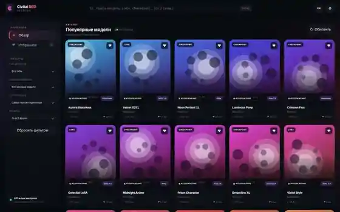
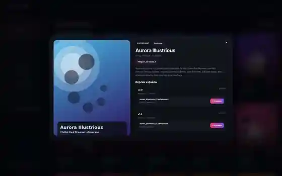
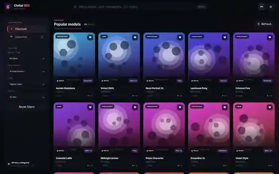

<div align="center">
  

# Civitai Red Browser

**Быстрый локальный веб-клиент для удобного просмотра и скачивания моделей Civitai.**  
**A fast local web client for browsing and downloading Civitai models.**

[Русский](#-русский) · [English](#-english)


</div>

---

# 🇷🇺 Русский

## О проекте

**Civitai Red Browser** — локальный веб-интерфейс на чистом Node.js для работы с `civitai.red` и совместимым Civitai API. Он делает каталог моделей компактнее и удобнее: поиск, фильтры, избранное, подробная информация, изображения и видео-превью, версии файлов и скачивание доступны в одном тёмном интерфейсе.

Проект запускается через один файл `server.js`, не требует Electron, Docker и обязательной установки npm-зависимостей.

> [!IMPORTANT]
> Это неофициальный клиент. Проект не связан с Civitai и не является официальным продуктом Civitai.

## Возможности

- 🔎 Поиск моделей по каталогу Civitai.
- 🎛️ Фильтры по **типу модели**, **базовой модели**, сортировке и периоду.
- 💾 Фильтры и выбранный язык сохраняются между перезапусками.
- ❤️ Компактное избранное в `data/favorites.json` без хранения огромных объектов API.
- 🖼️ Изображения и 🎬 видео-превью с ленивой загрузкой и ограничением нагрузки на браузер.
- 📦 Просмотр версий модели, форматов и размеров файлов.
- ⬇️ Скачивание файлов через локальный сервер с API-ключом Civitai.
- ↗️ Открытие оригинальной страницы модели на Civitai из окна информации.
- 🇷🇺 / 🇬🇧 Полная русская и английская локализация с мгновенным переключением.
- ⚡ Компактные ответы локального API, ограниченный кэш, отмена устаревших запросов и оптимизированный DOM.
- 🔐 API-ключ хранится локально в `.env` и не возвращается браузеру.
- 🛟 Поддерживается резервный API endpoint `civitai.com`, если основной endpoint временно недоступен.
- 🧾 Чистые серверные логи: сообщение `[READY]` при запуске и только полезные `[WARN]` при проблемах.

## Скриншоты

### Каталог — русский интерфейс



### Информация о модели — русский интерфейс



> Скриншоты сделаны на локальных демонстрационных данных. Интерфейс, локализация и поведение элементов — реальные.

## Требования

- **Node.js 18.17 или новее**.
- Современный браузер: Chrome, Chromium, Edge, Opera, Firefox и т. п.
- API-ключ Civitai для функций, которым требуется авторизация.

## Установка и запуск

```bash
# 1. Клонировать репозиторий
git clone https://github.com/MiHoSkA/CivitaiRed_Browser.git

# 2. Перейти в папку проекта
cd CivitaiRed_Browser

# 3. Запустить сервер
node server.js
```

На Windows также можно запустить:

```text
start.bat
```

После запуска открой:

```text
http://127.0.0.1:3210
```

В консоли появится:

```text
[READY] Civitai Red Browser v1.3.1 running at http://127.0.0.1:3210
```

## API-ключ Civitai

1. Открой сайт локально.
2. Нажми кнопку **⚙ Настройки**.
3. Вставь API-ключ Civitai.
4. Нажми **Сохранить настройки**.

После этого сервер создаст локальный `.env` и сохранит токен в `CIVITAI_API_TOKEN`. `.env` исключён из Git через `.gitignore`, поэтому локальный ключ не должен попасть в репозиторий.

Ключ не имеет внутреннего таймера удаления: он остаётся сохранённым между перезапусками, пока пользователь сам не заменит файл/значение.

## Данные

Локальные пользовательские данные находятся в папке `data`:

```text
data/
├── favorites.json
└── settings.json
```

JSON-файлы форматируются с отступами и остаются удобными для ручного просмотра и редактирования.

## Структура проекта

```text
CivitaiRed_Browser/
├── data/
│   ├── favorites.json
│   └── settings.json
├── public/
│   ├── assets/
│   │   └── favicon.svg
│   ├── app.js
│   ├── index.html
│   └── style.css
├── screenshots/
│   ├── catalog-ru.webp
│   ├── model-ru.webp
│   ├── catalog-en.webp
│   └── model-en.webp
├── .gitignore
├── package.json
├── server.js
├── start.bat
└── start.sh
```

---

# 🇬🇧 English

## About

**Civitai Red Browser** is a local Node.js web interface for `civitai.red` and the compatible Civitai API. It provides a cleaner way to browse the model catalog with search, filters, favorites, model details, image/video previews, file versions, and direct downloads in one dark interface.

The project runs from a single `server.js` entry point and does not require Electron, Docker, or mandatory npm dependencies.

> [!IMPORTANT]
> This is an unofficial client. It is not affiliated with Civitai and is not an official Civitai product.

## Features

- 🔎 Search the Civitai model catalog.
- 🎛️ Filter by **model type**, **base model**, sort order, and period.
- 💾 Filters and the selected UI language persist across restarts.
- ❤️ Compact favorites stored in `data/favorites.json` without saving huge raw API objects.
- 🖼️ Image and 🎬 video previews with lazy loading and browser-load limits.
- 📦 Inspect model versions, file formats, and file sizes.
- ⬇️ Download model files through the local server using your Civitai API key.
- ↗️ Open the original Civitai model page directly from the model details dialog.
- 🇷🇺 / 🇬🇧 Full Russian and English localization with instant switching.
- ⚡ Compact local API responses, bounded caches, stale-request cancellation, and optimized DOM rendering.
- 🔐 The API key stays local in `.env` and is never returned to the browser.
- 🛟 Fallback to `civitai.com` when the primary API endpoint is temporarily unavailable.
- 🧾 Clean server logs: a `[READY]` startup message and useful `[WARN]` messages only when something needs attention.

## Screenshots

### Catalog — English UI



### Model details — English UI


> Screenshots use local showcase data. The interface, localization, and UI behavior shown are real.

## Requirements

- **Node.js 18.17 or newer**.
- A modern browser such as Chrome, Chromium, Edge, Opera, or Firefox.
- A Civitai API key for features that require authentication.

## Install and run

```bash
# 1. Clone the repository
git clone https://github.com/MiHoSkA/CivitaiRed_Browser.git

# 2. Enter the project directory
cd CivitaiRed_Browser

# 3. Start the server
node server.js
```

On Windows you can also run:

```text
start.bat
```

Then open:

```text
http://127.0.0.1:3210
```

The console should show:

```text
[READY] Civitai Red Browser v1.3.1 running at http://127.0.0.1:3210
```

## Civitai API key

1. Open the local site.
2. Click **⚙ Settings**.
3. Paste your Civitai API key.
4. Click **Save settings**.

The server will create a local `.env` file and store the token as `CIVITAI_API_TOKEN`. `.env` is excluded by `.gitignore`, so your local secret should not be committed to the repository.

The application does not expire the key on a timer. It remains stored between restarts until the local value/file is deliberately changed.

## Local data

User data is stored in the `data` directory:

```text
data/
├── favorites.json
└── settings.json
```

JSON files are pretty-printed and remain easy to inspect or edit manually.

## Project structure

```text
CivitaiRed_Browser/
├── data/
│   ├── favorites.json
│   └── settings.json
├── public/
│   ├── assets/
│   │   └── favicon.svg
│   ├── app.js
│   ├── index.html
│   └── style.css
├── screenshots/
│   ├── catalog-ru.webp
│   ├── model-ru.webp
│   ├── catalog-en.webp
│   └── model-en.webp
├── .gitignore
├── package.json
├── server.js
├── start.bat
└── start.sh
```

---

<div align="center">
  <strong>Civitai Red Browser · v1.3.1</strong><br>
  Local-first · Dark UI · RU / EN
</div>
