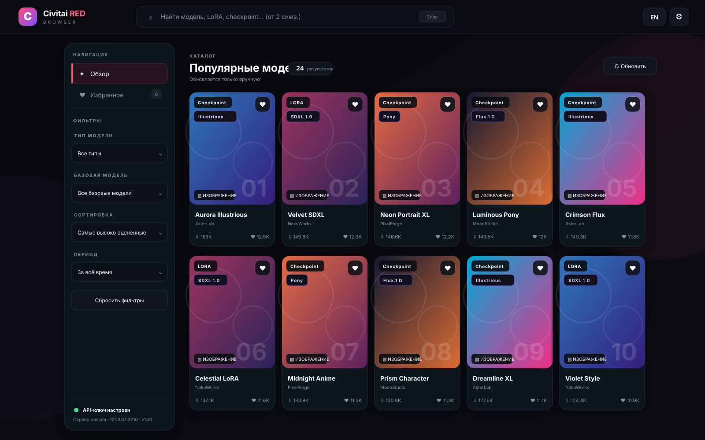
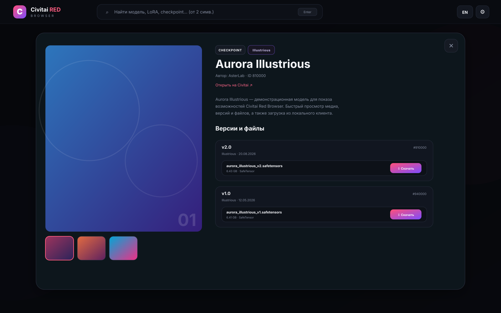
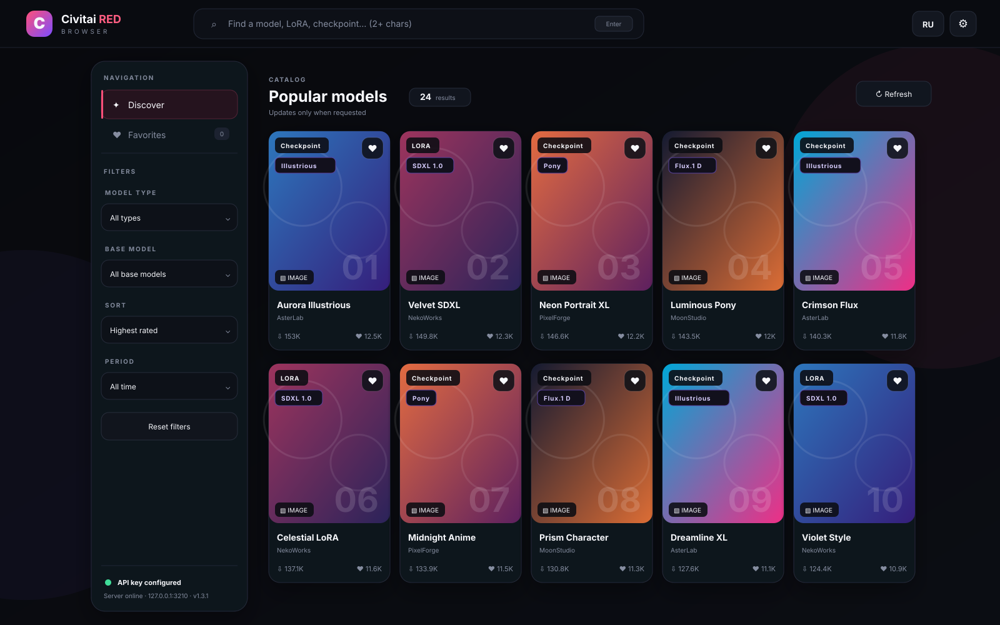
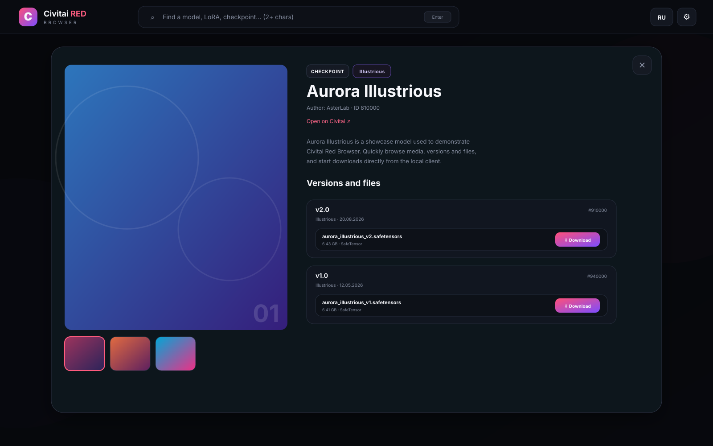

<div align="center">
  

# Civitai Red Browser

**Локальный веб-клиент для моделей, коллекций и публикаций Civitai.**  
**A local web client for Civitai models, collections, and posts.**

[Русский](#-русский) · [English](#-english)


</div>

---

# 🇷🇺 Русский

## О проекте

**Civitai Red Browser** — локальный веб-интерфейс на чистом Node.js для работы с `civitai.red` и совместимым Civitai API. Он делает каталог моделей компактнее и удобнее: поиск, фильтры, избранное, подробная информация, изображения и видео-превью, версии файлов и скачивание доступны в одном тёмном интерфейсе.

Проект запускается через один файл `server.js`, не требует Electron, Docker и обязательной установки npm-зависимостей.

> [!IMPORTANT]
> Это неофициальный клиент. Проект не связан с Civitai и не является официальным продуктом Civitai.

## Возможности

- 🔎 Поиск моделей по каталогу Civitai.
- 🎛️ Фильтры по **типу модели**, **базовой модели**, сортировке и периоду.
- 💾 Фильтры и выбранный язык сохраняются между перезапусками.
- ❤️ Компактное избранное в `data/favorites.json` без хранения огромных объектов API.
- 🖼️ Изображения и 🎬 видео-превью с ленивой загрузкой и ограничением нагрузки на браузер.
- 📦 Просмотр версий модели, форматов и размеров файлов.
- ⬇️ Скачивание файлов через локальный сервер с API-ключом Civitai.
- ↗️ Открытие оригинальной страницы модели на Civitai из окна информации.
- 🇷🇺 / 🇬🇧 Полная русская и английская локализация с мгновенным переключением.
- ⚡ Компактные ответы локального API, ограниченный кэш, отмена устаревших запросов и оптимизированный DOM.
- 🔐 API-ключ хранится локально в `.env` и не возвращается браузеру.
- 🛟 Поддерживается резервный API endpoint `civitai.com`, если основной endpoint временно недоступен.
- 🧾 Серверные логи: `[READY]` при запуске, `[WARN]` и `[ERROR]` при проблемах.
- 👤 Профиль аккаунта, аватар и баланс Buzz с разбивкой по видам.
- ▦ Коллекции аккаунта: модели, изображения, публикации и статьи; добавление и удаление элементов, создание приватных, публичных и доступных по ссылке коллекций.
- 🗂️ Раздел **Мой контент** с вкладками **Медиа** и **Публикации**, просмотром данных генерации и копированием промптов.
- 📤 Публикация изображений и видео через выбор файлов или перетаскивание; удаление собственных медиа и публикаций с подтверждением.
- 🔒 Приватный режим с паролем: каталог без контента 18+, скрытые персональные разделы и управление ключом.
- 🔎 Поиск по Enter, ручное обновление каталога и резервный поиск по части каталога при сбоях основного поиска.

## Скриншоты

### Каталог — русский интерфейс



### Информация о модели — русский интерфейс



> Иллюстрации из предыдущей версии на демонстрационных данных. Новые разделы версии 1.8.0 здесь не показаны; текущий интерфейс может отличаться.

## Требования

- **Node.js 18.17 или новее**.
- Современный браузер: Chrome, Chromium, Edge, Opera, Firefox и т. п.
- API-ключ Civitai для функций, которым требуется авторизация.

## Установка и запуск

```bash
# 1. Клонировать репозиторий
git clone https://github.com/MiHoSkA/CivitaiRed_Browser.git

# 2. Перейти в папку проекта
cd CivitaiRed_Browser

# 3. Запустить сервер
node server.js
```

Установка npm-зависимостей не требуется. Альтернативная команда запуска — `npm start`.

На Windows также можно запустить:

```text
start.bat
```

На Linux/macOS из папки проекта: `sh start.sh`.

После запуска открой:

```text
http://127.0.0.1:3210
```

В консоли появится:

```text
[READY] Civitai Red Browser v1.8.0 running at http://127.0.0.1:3210
```

## API-ключ Civitai

1. Открой сайт локально.
2. Нажми кнопку **⚙ Настройки**.
3. Вставь API-ключ Civitai.
4. Нажми **Сохранить настройки**.

После этого сервер создаст локальный `.env` и сохранит токен в `CIVITAI_API_TOKEN`. Полный сохранённый ключ не возвращается интерфейсу: отображается только маска с последними четырьмя символами. Ключ остаётся между перезапусками; заменить или удалить его можно в настройках.

> [!IMPORTANT]
> В текущем `.gitignore` нет правила для `.env`. Не загружай файл с ключом в GitHub и не включай его в публичные архивы.

Для функций аккаунта нужны соответствующие разрешения ключа. Интерфейс отдельно сообщает об отсутствии прав **Media Write** (публикация), **Media Delete** (удаление) и **Collections Write** (изменение коллекций). Доступность данных аккаунта и операций зависит от API Civitai и прав ключа.

## Коллекции и публикации

- **Избранное** хранится локально; **Коллекции** загружаются из аккаунта Civitai.
- Кнопка **В коллекцию** позволяет выбрать коллекцию подходящего типа или создать новую. Название — до 30 символов; доступ — приватный, по ссылке или публичный.
- В разделе **Мой контент** можно просматривать свои медиа и публикации, открывать оригиналы и доступные данные генерации.
- Для создания публикации нажми **Новая публикация**, добавь файлы, при необходимости укажи название и описание, затем нажми **Опубликовать**.
- Поддерживаются PNG, JPEG, WebP, GIF, AVIF, MP4, WebM и MOV. Лимиты клиента: до **20 файлов**, до **50 МБ** на изображение и до **750 МБ** на видео.
- После отправки Civitai обрабатывает медиа, поэтому они могут появиться в списке не сразу.
- Удаление медиа или публикации выполняется в аккаунте Civitai, а не только в локальном списке.

## Приватный режим

В **Настройки → Приватный режим** можно установить пароль длиной от **4 до 200 символов**, сменить его, удалить или сразу заблокировать доступ.

При блокировке остаются просмотр и скачивание моделей без контента 18+. Избранное, коллекции, свой контент, Buzz и управление API-ключом недоступны до разблокировки. Фильтрация зависит от маркировки контента Civitai.

В `data/security.json` сохраняются соль и хеш пароля scrypt, а не сам пароль. Сессия разблокировки истекает после 12 часов бездействия и сбрасывается при перезапуске сервера. Это ограничение доступа через интерфейс, а не шифрование локальных файлов.

## Настройка сервера

Параметры можно задать в локальном `.env` или переменных окружения. Значения окружения имеют приоритет; после изменения параметров запуска перезапусти сервер.

| Параметр | По умолчанию | Назначение |
| --- | --- | --- |
| `HOST` | `127.0.0.1` | Адрес прослушивания |
| `PORT` | `3210` | Порт |
| `DATA_DIR` | `data` | Папка пользовательских данных |
| `CIVITAI_ENV_FILE` | `.env` | Путь к файлу настроек; задаётся до запуска |
| `CIVITAI_API_TOKEN` | Не задан | API-ключ |
| `CIVITAI_API_BASE` | `https://civitai.red` | Основной API |
| `CIVITAI_API_FALLBACK` | `https://civitai.com` | Резервный API |
| `REQUEST_TIMEOUT_MS` | `20000` | Тайм-аут запросов к API, мс |
| `SEARCH_MIN_LENGTH` | `2` | Минимальная длина поискового запроса |

По умолчанию сервер доступен только на этом компьютере. Изменение `HOST` на `0.0.0.0` открывает доступ из сети: доступные без блокировки операции смогут выполнять и другие устройства, которые достигают сервера.

## Если что-то не работает

- **Ошибка соединения:** проверь, запущен ли `node server.js`, и открой адрес из строки `[READY]`.
- **Нет доступа к аккаунту или операции:** проверь ключ и его разрешения в настройках.
- **429, тайм-аут или перегрузка:** дождись повтора либо обнови список позже; работа зависит от доступности Civitai.
- **Резервный поиск:** он проверяет ограниченную часть каталога и не гарантирует полную выдачу.
- **Пустой список после публикации:** подожди обработки медиа на стороне Civitai и обнови список.

## Данные

Локальные пользовательские данные находятся в папке `data`:

```text
data/
├── favorites.json
├── settings.json
└── security.json
```

`favorites.json` — локальное избранное, `settings.json` — настройки интерфейса, `security.json` — параметры пароля. Ключ хранится отдельно в `.env`. Для переноса локальных настроек сохрани папку `data` и `.env` в приватную резервную копию.

## Структура проекта

```text
CivitaiRed_Browser/
├── data/
│   ├── favorites.json
│   ├── settings.json
│   └── security.json
├── public/
│   ├── assets/
│   │   └── favicon.svg
│   ├── app.js
│   ├── index.html
│   └── style.css
├── screenshots/
│   ├── catalog-ru.svg
│   ├── model-ru.svg
│   ├── catalog-en.svg
│   └── model-en.svg
├── .gitignore
├── package.json
├── server.js
├── start.bat
└── start.sh
```

---

# 🇬🇧 English

## About

**Civitai Red Browser** is a local Node.js web interface for `civitai.red` and the compatible Civitai API. It provides a cleaner way to browse the model catalog with search, filters, favorites, model details, image/video previews, file versions, and direct downloads in one dark interface.

The project runs from a single `server.js` entry point and does not require Electron, Docker, or mandatory npm dependencies.

> [!IMPORTANT]
> This is an unofficial client. It is not affiliated with Civitai and is not an official Civitai product.

## Features

- 🔎 Search the Civitai model catalog.
- 🎛️ Filter by **model type**, **base model**, sort order, and period.
- 💾 Filters and the selected UI language persist across restarts.
- ❤️ Compact favorites stored in `data/favorites.json` without saving huge raw API objects.
- 🖼️ Image and 🎬 video previews with lazy loading and browser-load limits.
- 📦 Inspect model versions, file formats, and file sizes.
- ⬇️ Download model files through the local server using your Civitai API key.
- ↗️ Open the original Civitai model page directly from the model details dialog.
- 🇷🇺 / 🇬🇧 Full Russian and English localization with instant switching.
- ⚡ Compact local API responses, bounded caches, stale-request cancellation, and optimized DOM rendering.
- 🔐 The API key stays local in `.env` and is never returned to the browser.
- 🛟 Fallback to `civitai.com` when the primary API endpoint is temporarily unavailable.
- 🧾 Server logs: `[READY]` at startup, with `[WARN]` and `[ERROR]` for problems.
- 👤 Account profile, avatar, and Buzz balance with a breakdown by type.
- ▦ Account collections for models, images, posts, and articles; add/remove items and create private, unlisted, or public collections.
- 🗂️ **My content** with **Media** and **Posts** tabs, generation metadata, and prompt copying.
- 📤 Publish images and videos using file selection or drag and drop; delete your own media and posts with confirmation.
- 🔒 Password-based private mode with a non-adult catalog and hidden personal sections and API-key controls.
- 🔎 Search on Enter, manual catalog refresh, and a partial-catalog fallback search when the upstream search fails.

## Screenshots

### Catalog — English UI



### Model details — English UI



> These illustrations show an earlier version using showcase data. They do not include the new 1.8.0 sections; the current interface may differ.

## Requirements

- **Node.js 18.17 or newer**.
- A modern browser such as Chrome, Chromium, Edge, Opera, or Firefox.
- A Civitai API key for features that require authentication.

## Install and run

```bash
# 1. Clone the repository
git clone https://github.com/MiHoSkA/CivitaiRed_Browser.git

# 2. Enter the project directory
cd CivitaiRed_Browser

# 3. Start the server
node server.js
```

No npm dependency installation is required. You can also start the server with `npm start`.

On Windows you can also run:

```text
start.bat
```

On Linux/macOS, run `sh start.sh` from the project directory.

Then open:

```text
http://127.0.0.1:3210
```

The console should show:

```text
[READY] Civitai Red Browser v1.8.0 running at http://127.0.0.1:3210
```

## Civitai API key

1. Open the local site.
2. Click **⚙ Settings**.
3. Paste your Civitai API key.
4. Click **Save settings**.

The server creates a local `.env` file and stores the token as `CIVITAI_API_TOKEN`. It never returns the full stored key to the UI, only a mask with the last four characters. The key persists across restarts and can be replaced or removed in Settings.

> [!IMPORTANT]
> The current `.gitignore` does not exclude `.env`. Do not upload a file containing your key to GitHub or include it in public archives.

Account features require appropriate API-key permissions. The UI reports missing **Media Write** (publishing), **Media Delete** (deletion), and **Collections Write** (collection changes) permissions. Account data and operations depend on the Civitai API and the key's permissions.

## Collections and publishing

- **Favorites** are local; **Collections** come from your Civitai account.
- **To collection** lets you select a matching collection or create one. Names allow up to 30 characters; visibility can be private, unlisted, or public.
- **My content** shows your media and posts, original links, and available generation metadata.
- Use **New post**, add files, optionally enter a title and description, and click **Publish**.
- Supported formats: PNG, JPEG, WebP, GIF, AVIF, MP4, WebM, and MOV. Client limits: **20 files**, **50 MB per image**, and **750 MB per video**.
- Civitai processes uploaded media, so newly published items may not appear immediately.
- Deleting media or posts removes them from Civitai, not just from the local list.

## Private mode

In **Settings → Private mode**, set a password of **4–200 characters**, change or remove it, or lock access immediately.

While locked, browsing and downloading non-adult models remain available. Favorites, collections, your content, Buzz, and API-key controls require unlocking. Content filtering relies on Civitai's classifications.

`data/security.json` stores a salt and scrypt password hash, not the password itself. Unlock sessions expire after 12 hours of inactivity and are cleared when the server restarts. Private mode restricts interface access; it does not encrypt local files.

## Server configuration

Set options in the local `.env` file or environment variables. Environment variables take precedence. Restart the server after changing startup options.

| Variable | Default | Purpose |
| --- | --- | --- |
| `HOST` | `127.0.0.1` | Listening address |
| `PORT` | `3210` | Port |
| `DATA_DIR` | `data` | User data directory |
| `CIVITAI_ENV_FILE` | `.env` | Environment file path; set before startup |
| `CIVITAI_API_TOKEN` | Unset | API key |
| `CIVITAI_API_BASE` | `https://civitai.red` | Primary API |
| `CIVITAI_API_FALLBACK` | `https://civitai.com` | Fallback API |
| `REQUEST_TIMEOUT_MS` | `20000` | API request timeout in milliseconds |
| `SEARCH_MIN_LENGTH` | `2` | Minimum search query length |

The default server address is accessible only on this computer. Setting `HOST=0.0.0.0` exposes it to the network: other devices that can reach the server can perform operations available without unlocking.

## Troubleshooting

- **Connection error:** ensure `node server.js` is running and open the address printed in `[READY]`.
- **Account or operation unavailable:** check your API key and its permissions.
- **429, timeout, or overload:** wait for a retry or refresh later; the client depends on Civitai availability.
- **Fallback search:** only a limited portion of the catalog is scanned, so results may be incomplete.
- **Empty list after publishing:** allow Civitai to process the media, then refresh.

## Local data

User data is stored in the `data` directory:

```text
data/
├── favorites.json
├── settings.json
└── security.json
```

`favorites.json` stores local favorites, `settings.json` stores UI settings, and `security.json` stores password parameters. The API key is stored separately in `.env`. Back up `data` and `.env` privately to transfer local settings.

## Project structure

```text
CivitaiRed_Browser/
├── data/
│   ├── favorites.json
│   ├── settings.json
│   └── security.json
├── public/
│   ├── assets/
│   │   └── favicon.svg
│   ├── app.js
│   ├── index.html
│   └── style.css
├── screenshots/
│   ├── catalog-ru.svg
│   ├── model-ru.svg
│   ├── catalog-en.svg
│   └── model-en.svg
├── .gitignore
├── package.json
├── server.js
├── start.bat
└── start.sh
```

---

<div align="center">
  <strong>Civitai Red Browser · v1.8.0</strong><br>
  Local-first · Dark UI · RU / EN
</div>
